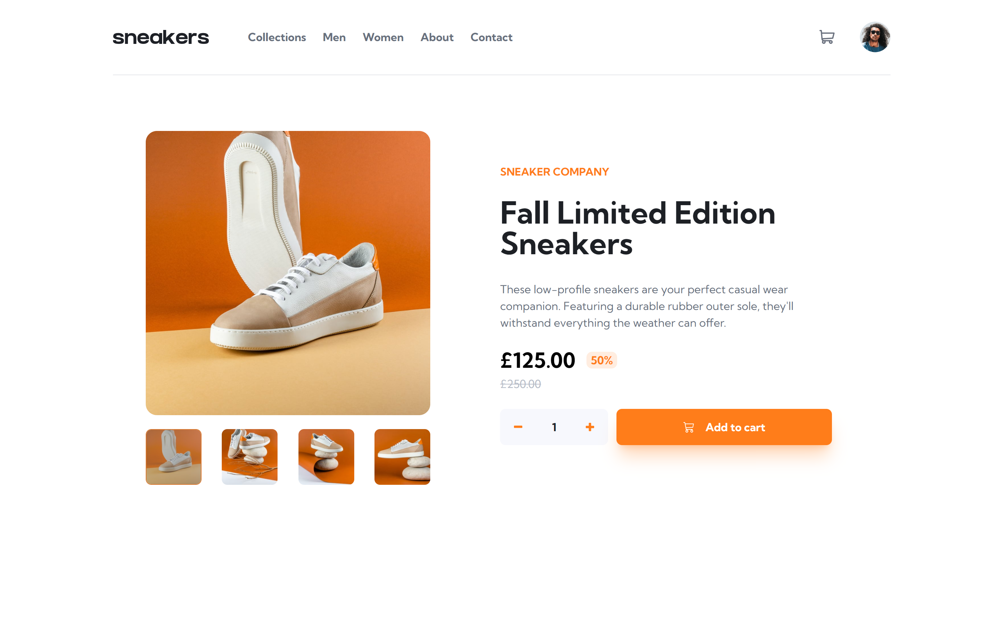

# Hi Everyone!👋

Fully responsive e-commerce product page. I made good use of react context api and useReducer hook for my state management

- Check out the link for this project: [https://jcasia-e-commerce-product-page.netlify.app/](https://jcasia-e-commerce-product-page.netlify.app/)

### I built this project using:

- React with TypeScript
- React Context API & useReducer for state management
- Tailwind CSS

### Here are some screenshots of the project:

